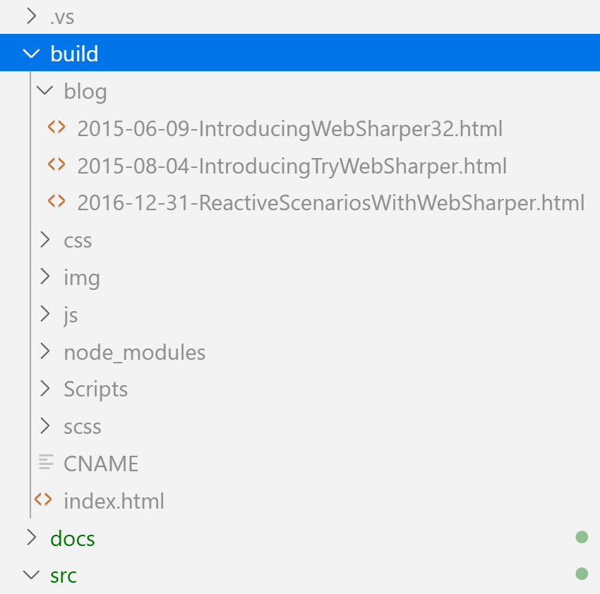

# BlogEngine - your F# static site generator


BlogEngine is a simple and highly configurable static site generator for F#. It uses [WebSharper](https://websharper.com) to build the pages of your website and to generate HTML files for them.

The repository provides a general blueprint to structure your static blog application, and without any changes is able to generate a static blog from a list of blog articles written in the markdown format.

There are three projects in this repository that you can use to further develop the built-in sample blog to your needs:

 * `src\Client` - this contains client-side functionality (to be run as JavaScript code) that you intend to embed in all (or some) of the output HTML pages. `Client` is a WebSharper+F# project and uses WebSharper to generate transpiled JavaScript code. Currently, this project consists of a single `Main.fs` file that enables F# syntax highlighting for markdown code blocks, and hides/shows the responsive drawer menu in the generated pages on mobile devices.

 * `src\Hosted` - this is a WebSharper client-server and an ASP.NET Core application. You can run it to self-host your blog and work with template/style/layout changes much more effectively without having to recompile on each update. Simply deploy, make changes to `index.html` in the root of the project, and refresh your page in your browser. You can also author your blog articles and see them in their rendered form by triggering a runtime update URL (see below.)

 * `src\Website` - this is a dummy WebSharper offline sitelet project that uses the code from `src\Hosted` and generates HTML pages in the `\build` root folder. It also copies all related artifacts (CSS, JS, images, etc.) into this folder, making it self-contained and ready to deploy in GitHub Pages or any other HTML server.

# How to build and run your blog

1) Run `.\install.ps` - do this the first time you start working with this repository. This script installs the required JS/CSS resources (only Bulma at the moment) and a convenient HTML server, `dotnet-serve` to serve the output.

2) In the root folder, run `dotnet build` - this builds and runs `src\Website` and its dependencies, and generates your HTML files in the top-level `build` folder. That folder will look something like the following, ready to deploy to your web server:

   

3) Run `.\start.cmd` - this invokes `dotnet-serve` on the output folder so you can view your blog articles in the browser (by default at `http://localhost:56001`). You can change the port, if needed in the script.

# Writing your blog articles

The input markdown files for your blog articles are in `src\Hosted\posts`. Add your `.md` files here with the naming convention `YYYY-MM-DD-YourArticleTitle.md`. Give at least the title in the YAML header, as follows:

```
---
title: A wonderful F# journey
subtitle: The best path to getting my F# blog up and running
---
```

Remember to rebuild this project after each change and/or new article to get the matching HTML output. Or alternatively, use the `src/Hosted` project to enable near-live edits - see below for details.

# Extending your blog website

The default blog is represented in `\src\Hosted\Main.fs` as follows:

```fsharp
type EndPoint =
    | [<EndPoint "GET /">] Home
    | [<EndPoint "GET /blog">] Article of slug:string
```

If you need other pages, such as an About page or a set of documentation pages, you can add further shapes to this type and enhance `Site.Main` accordingly.

# Making template changes

I recommend you run the `src\Hosted` project if you intend to make template/layout/style changes. By default, the master template (`index.html`) is used in such a way that updates to this file are reflected runtime, i.e. without requiring recompilation (unless you change the bindings/placeholders, in which case you need to recompile and adapt your `Main.fs` accordingly), significantly speeding up your development workflow.

You can run the hosted project as opposed to `src/Website` in Visual Studio by making it your default project and running it, and in Visual Studio Code (or in any terminal) by running (from the root folder):

```
dotnet run --project src\Hosted\Hosted.fsproj
```

By default, the hosted application is deployed to `localhost:5000`, note the different port here.

When you change existing blog articles or add new ones, you need to reload their markdown files. I have added a sitelet endpoint to trigger this:

```fsharp
type EndPoint =
    ...
    | [<EndPoint "GET /refresh">] Refresh
```

You can simply go to `http://localhost:5000/refresh`, and reload your article to reflect any changes you made to it while the hosted blog has been running.

Have fun writing your blog with BlogEngine!

# Appendix - Image credit

* `src\Hosted\img\Banner.jpg` by Plush Design Studio on Unsplash - https://unsplash.com/photos/UHqfUTDmdC4

